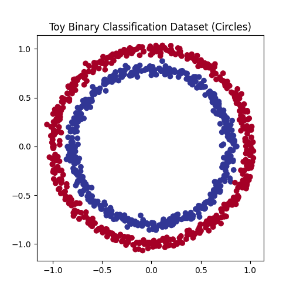
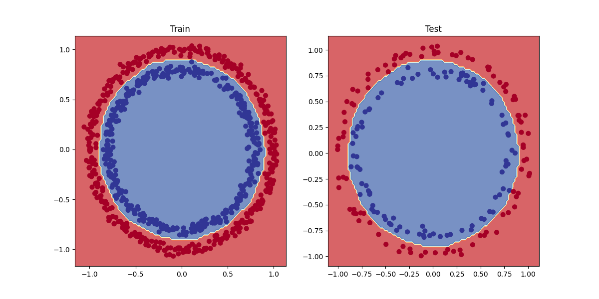

# PyTorch Fundamentals – Binary Classification

This repository demonstrates **core PyTorch fundamentals** by solving a **binary classification** problem on a synthetic non-linear dataset.

The project focuses on understanding how neural networks work **from scratch**, rather than relying on high-level abstractions.


## Notebook Overview

The notebook covers the full PyTorch workflow:

- Dataset creation and visualization
- Train / test split
- Tensor conversion and device handling (CPU / GPU)
- Custom neural network using `nn.Module`
- Loss functions and optimizers
- Manual training and evaluation loops
- Model evaluation and decision boundary visualization


## 📊 The Dataset

A synthetic **non-linear binary classification dataset** is generated using `make_circles` from `scikit-learn`.



Figure 1: Visualization of the dataset

This dataset is ideal for demonstrating why:
- Linear models fail
- Non-linear activation functions (ReLU) are required


## 🧠 The Model
The model is constructed using PyTorch's fundamental building blocks. Instead of using pre-configured models, this implementation defines the architecture explicitly to demonstrate:
- **Layer Construction:** Custom definition of fully connected layers.
- **Activation Functions:** Implementation of non-linearities (e.g., ReLU/Sigmoid) to capture complex data relationships.
- **Forward Pass:** Explicit calculation of the network's output.

## 📈 Decision Boundaries & Predictions

One of the key features of this repository is the visualization of the model's decision boundaries. These plots illustrate how the neural network separates different classes in the feature space.

- **Decision Boundaries:** We map the prediction landscape to show where the model draws the line between classes.


Figure 2: Visualization of the result (plotted Decision Boundaries)

### Running the Project

1. Clone the repository:
```bash
git clone https://github.com/BlagojaBudzak/pytorch-from-scratch.git
```

2. Install dependencies:
```bash
pip install -r requirements.txt
```

3. Open the notebook::
```bash
notebooks/pytorch_binary_classification_circles.ipynb
```

## 🏆Developed by Blagoja Budzakoski
